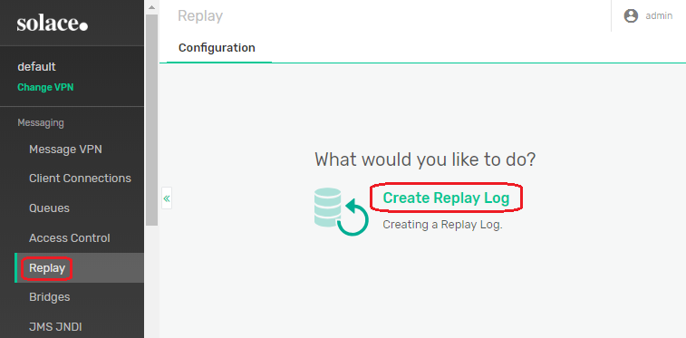
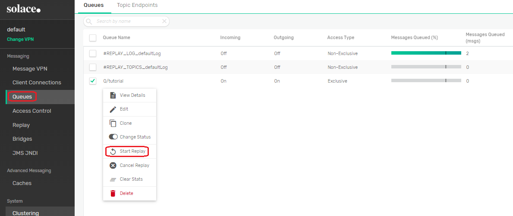

This feature introduction shows how a client can initiate and process replay of previously-published messages, as well as deal with externally initiated message replay.

## Feature Overview

At normal live publishing, guaranteed messages will be removed from the Solace message broker's [queue or topic endpoint](https://docs.solace.com/Messaging-Basics/Endpoints.htm#Endpoints ) after the consumer acknowledged receipt or successful processing. With Message Replay initiated for an endpoint, the message broker will re-publish a requested subset of previously-published and recorded messages, which enables a client to process these messages again.

Message Replay can be used for example if a client needs to catch up with missed messages and in several other [use cases](https://docs.solace.com/Features/Message-Replay.htm#Applicat ).

Replay for an endpoint can be initiated programmatically from an API client connected to an exclusive endpoint, or administratively from the message broker. After replay is complete the connected client will keep getting live messages delivered.

It is important to consider that initiating replay from the message broker will disconnect all connected client flows, active or not. A new flow needs to be started for a client wishing to receive replayed and subsequent messages.

## Prerequisite

A Replay Log must be created on the Solace message broker for the message-vpn, using [Message Replay CLI configuration](https://docs.solace.com/Configuring-and-Managing/Msg-Replay-Config.htm ){:target="_blank"} or using [Solace PubSub+ Manager](https://docs.solace.com/Solace-PubSub-Manager/PubSub-Manager-Overview.htm )(:target="_blank") administration console.

NOTE: Message Replay is supported in Solace PubSub+ message broker version 9.1 or later. Solace Java API version 10.5 or later is required.



## Code

### Checking for Message Replay capability

Message Replay must be supported on the message broker, therefore the code should check this first:

```java
void checkCapability(final CapabilityType cap) {
    System.out.printf("Checking for capability %s...", cap);
    if (session.isCapable(cap)) {
        System.out.println("OK");
    } else {
        System.out.println("FAILED - exiting.");
        finish(1);
    }
}

checkCapability(CapabilityType.MESSAGE_REPLAY);
```

### Initiating replay

First, a `ReplayStartLocation` object needs to be created to specify a subset of messages in the replay log, collected for replay.

There are two options:
* use `createReplayStartLocationBeginning()` to replay all recorded messages
* use `createReplayStartLocationDate(Date date)` to replay only messages received from a specified `date`.

Note: The `date` cannot be before the date of the replay log created, otherwise replay will fail.

```java
ReplayStartLocation replayStart = null;
// Example dateStr parameter: String dateStr = "2019-04-05T13:37:00";
if (dateStr != null) {
    SimpleDateFormat simpleDateFormat = new SimpleDateFormat("yyyy-MM-dd'T'HH:mm:ss");
    simpleDateFormat.setTimeZone(TimeZone.getTimeZone("UTC")); // This line converts the given date into UTC time zone
    Date date = simpleDateFormat.parse(dateStr);
    replayStart = JCSMPFactory.onlyInstance().createReplayStartLocationDate(date);
} else {
    replayStart = JCSMPFactory.onlyInstance().createReplayStartLocationBeginning();
}
```

Then indicate that replay is requested by setting a non-null `ReplayStartLocation` in `ConsumerFlowProperties`, which is then passed to `JCSMPSession.createFlow` as a parameter.

The target `Endpoint` for replay is also set in `ConsumerFlowProperties` below. This is the normal way of setting an endpoint for a consumer flow.

```java
ConsumerFlowProperties consumerFlowProps = new ConsumerFlowProperties();
:
Queue queue = JCSMPFactory.onlyInstance().createQueue(queueName);  // targeting this endpoint for replay
consumerFlowProps.setEndpoint(queue);
:
consumerFlowProps.setReplayStartLocation(replayStart);
/*
 * Create and start a consumer flow
 */
consumer = session.createFlow(this, consumerFlowProps, null, consumerEventHandler);
consumer.start();
System.out.println("Flow (" + consumer + ") created");
``` 

### Replay-related events

There are several replay-related events defined corresponding to various conditions, which can be processed in an event handler implementing the `FlowEventHandler` interface. For the definition of the events refer to the [Java API Reference](https://docs.solace.com/API-Developer-Online-Ref-Documentation/java/index.html )(:target="_blank").

Some of the important events:
* REPLAY_STARTED - a replay has been started administratively from the message-broker, the consumer flow is being disconnected.
* REPLAY_START_TIME_NOT_AVAILABLE - the requested replay start date is before the event log was created, which is not allowed - see above section, "Initiating replay"
* REPLAY_FAILED

Here we will define the `ReplayFlowEventHandler`.

Note that in the Java API the event handler is called on the main reactor thread and manipulating the `session` from here is not allowed because it can lead to deadlock. There will be also a related exception raised where the `session` can be manipulated in the exception handler, see the description in the next section. The event handler will set `replayErrorResponseSubcode` which will be used in the exception handler.

```java
private volatile int replayErrorResponseSubcode = JCSMPErrorResponseSubcodeEx.UNKNOWN;
class ReplayFlowEventHandler implements FlowEventHandler {
    @Override
    public void handleEvent(Object source, FlowEventArgs event) {
        System.out.println("Consumer received flow event: " + event);
        if (event.getEvent() == FlowEvent.FLOW_DOWN) {
            if (event.getException() instanceof JCSMPErrorResponseException) {
                JCSMPErrorResponseException ex = (JCSMPErrorResponseException) event.getException();
                // Store the subcode for the exception handler
                replayErrorResponseSubcode = ex.getSubcodeEx();
                // Placeholder for additional event handling
                // Do not manipulate the session from here
                // onException() is the correct place for that
                switch (replayErrorResponseSubcode) {
                    case JCSMPErrorResponseSubcodeEx.REPLAY_STARTED:
                    case JCSMPErrorResponseSubcodeEx.REPLAY_FAILED:
                    case JCSMPErrorResponseSubcodeEx.REPLAY_CANCELLED:
                    case JCSMPErrorResponseSubcodeEx.REPLAY_LOG_MODIFIED:
                    case JCSMPErrorResponseSubcodeEx.REPLAY_START_TIME_NOT_AVAILABLE:
                    case JCSMPErrorResponseSubcodeEx.REPLAY_MESSAGE_UNAVAILABLE:
                    case JCSMPErrorResponseSubcodeEx.REPLAYED_MESSAGE_REJECTED:
                        break;
                    default:
                        break;
                }
            }
        }
    }
}
:
private ReplayFlowEventHandler consumerEventHandler = null;
:
consumerEventHandler = new ReplayFlowEventHandler();
:
/*
 * Create and start a consumer flow
 */
consumer = session.createFlow(this, consumerFlowProps, null, consumerEventHandler);
```

### Replay-related Exceptions

If a replay related event occurs the flow is disconnected with `JCSMPFlowTransportUnsolicitedUnbindException` and the exception handler is called if the `onException` method is overridden in the `XMLMessageListener` object that was passed to `createFlow()`.

In this sample the `MessageReplay` class implements `XMLMessageListener`, hence `this` is passed as the first parameter to `createFlow()`.

Here is the overridden `onException` method. In this example if the exception is `JCSMPFlowTransportUnsolicitedUnbindException` it will process the `replayErrorResponseSubcode` set by the event handler (see previous section).
* REPLAY_STARTED is handled by creating a new flow. 
* REPLAY_START_TIME_NOT_AVAILABLE is handled by adjusting `ReplayStartLocation` to all recorded messages. 

```
@Override
public void onException(JCSMPException exception) {
    if (exception instanceof JCSMPFlowTransportUnsolicitedUnbindException) {
        try {
            if (exception instanceof JCSMPFlowTransportUnsolicitedUnbindException) {
                switch (replayErrorResponseSubcode) {
                    case JCSMPErrorResponseSubcodeEx.REPLAY_STARTED:
                        System.out.println("Sample handling of an unsolicited unbind for replay initiated by recreating the flow");
                        if (consumerFlowProps.getReplayStartLocation() != null) {
                            consumerFlowProps.setReplayStartLocation(null);
                        }
                        consumer = session.createFlow(this, consumerFlowProps, null, consumerEventHandler);
                        consumer.start();
                        break;
                    case JCSMPErrorResponseSubcodeEx.REPLAY_START_TIME_NOT_AVAILABLE:
                        System.out.println("Start date was before the log creation date, initiating replay for all messages instead");
                        consumerFlowProps.setReplayStartLocation(JCSMPFactory.onlyInstance().createReplayStartLocationBeginning());
                        consumer = session.createFlow(this, consumerFlowProps, null, consumerEventHandler);
                        consumer.start();
                        break;
                    default:
                        break;
                }
                replayErrorResponseSubcode = JCSMPErrorResponseSubcodeEx.UNKNOWN; // reset after handling
            }
        }
        catch (JCSMPException e) {
            e.printStackTrace();
        }
    } else {
        exception.printStackTrace();
    }
}
```

## Running the Sample

Follow the instructions to [build the samples](https://github.com/SolaceSamples/solace-samples-java#build-the-samples ).

Before running this sample, be sure that message-replay is enabled in the VPN used. Also messages must have been published to the replay-log for the queue that is used. The "QueueProducer" sample can be used to create and publish messages to the queue. The "QueueConsumer" sample can be used to drain the queue, so that replay is performed on an empty queue and observed by this sample. Both samples are from the [Persistence with Queues tutorial](https://solace.com/samples/solace-samples-java/persistence-with-queues/ ).

```
$ ./build/staged/bin/queueProducer <host:port> <client-username>@<message-vpn> [<client-password>]
$ ./build/staged/bin/queueConsumer <host:port> <client-username>@<message-vpn> [<client-password>]
```

Then run this sample and observe the followings, particularly the "messageId"s listed :

1. First, a client initiated replay is started when the flow connects. All messages are requested and replayed from the replay log.
```
$ ./build/staged/bin/featureMessageReplay -h <host:port> -u <client-username>@<message-vpn> -q Q/tutorial [-w <client-passWord>]
```
2. After replay the application is able to receive live messages
```
$ ./build/staged/bin/queueProducer <host:port> <client-username>@<message-vpn> [client-password]
```
3. Now start a CLI/Message-Router initiated replay. The flow event handler monitors for a replay start event. When the Message-Router initiates a replay, the flow will see a DOWN_ERROR event with cause 'Replay Started'. This means an administrator has initiated a replay, and the application must destroy and re-create the flow to receive the replayed messages.



## Learn More

<ul>

<li>Related Source Code: <a href="{{ site.repository }}{{ item.link }}" target="_blank">{{ item.label }}</a></li>

<li><a href="https://docs.solace.com/Features/Message-Replay.htm" target="_blank">Solace Feature Documentation</a></li>
</ul>


 